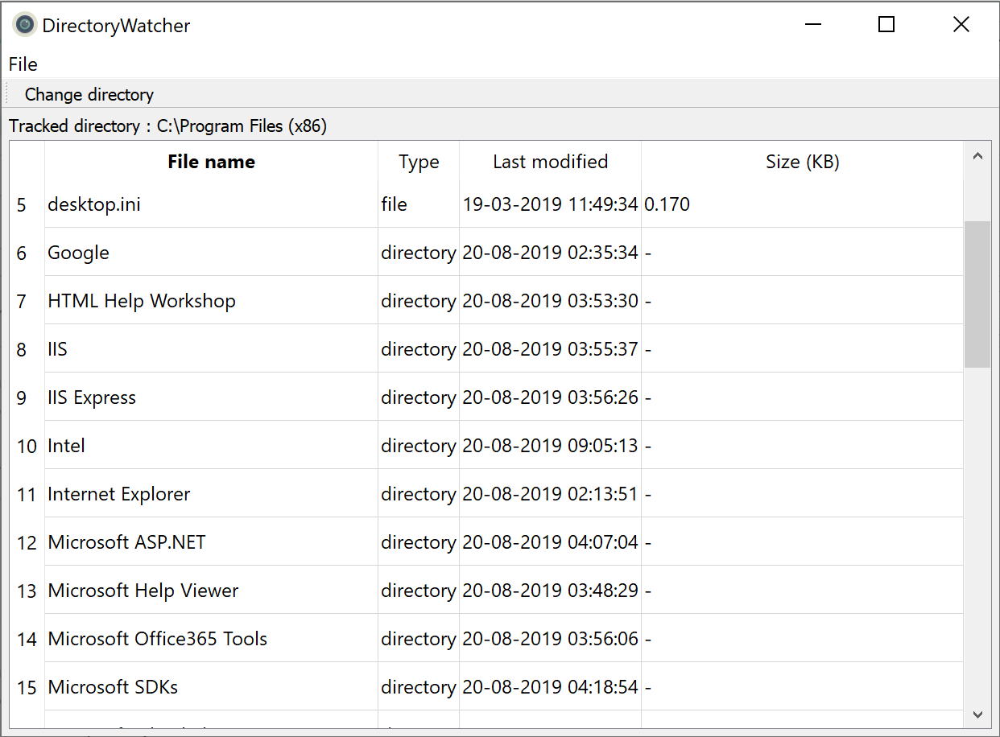

# directory-watcher [](https://ci.appveyor.com/project/NikitkoCent/directory-watcher/branch/master)
Qt-based application-example for tracking directory contents using WinAPI methods such as:
* [`ReadDirectoryChanges`](https://docs.microsoft.com/en-us/windows/win32/api/winbase/nf-winbase-readdirectorychangesw), [`WaitForMultipleObjects`](https://docs.microsoft.com/en-us/windows/win32/api/synchapi/nf-synchapi-waitformultipleobjects);
* [`GetOverlappedResult`](https://docs.microsoft.com/en-us/windows/win32/api/ioapiset/nf-ioapiset-getoverlappedresult);
* [`FindFirstFile`](https://docs.microsoft.com/en-us/windows/win32/api/fileapi/nf-fileapi-findfirstfilea), [`FindNextFile`](https://docs.microsoft.com/en-us/windows/win32/api/fileapi/nf-fileapi-findnextfilea).

<details>
<summary>Appearance</summary>



</details>

## Build
This project is CMake-based so you need to use CMake to build it.

### Requirements
* Windows (cross-compiling under Linux wasn't tested);
* C++14-compatible compiler;
* Qt5 installation;
* Installed Qt toolchain that support chosen compiler;
* CMake 3.10.0 or higher.

### General notes
* Make sure that your Qt toolchain architecture corresponds to compiler architecture (for example, if you want to use MSVC in Win64 configuration, you need appropriate Qt toolchain, like `msvc2015_64` in case of MSVS2015);
* You need to pass the path of Qt CMake modules via `CMAKE_PREFIX_PATH`;
* In some cases you also need to pass some additional information to CMake (like in [this example](#build-using-mingw-taken-from-qt-installation));
* In case of problems, see [this official Qt<->CMake manual](https://doc.qt.io/qt-5/cmake-manual.html). Also you can see [integration with AppVeyor](https://github.com/NikitkoCent/directory-watcher/blob/master/.appveyor.yml).

### Build using Microsoft Visual Studio 2015 (Win64 configuration)
Generate solution (run from project root):
```bat
cd build
cmake -G"Visual Studio 14 2015 Win64" -DCMAKE_PREFIX_PATH="Path/To/Qt/version/msvc2015_64/lib/cmake/Qt5" ..
```
... and then build:
```bat
cmake --build . --config Release
```

You can also deploy executable with all dependencies to `bin` directory via `install` target:
```bat
cmake --build . --config Release --target install
```

... and/or create `.tar.gz` and `.zip` archives in `bin/packages` directory via `package` target:
```bat
cmake --build . --config Release --target package
```

### Build using MinGW taken from Qt installation
Please make sure you have `Path/To/Qt/Tools/mingw*_*/bin` in your `PATH` environment variable.

Generate build scripts (run from project root):
```bat
cd build
cmake -G"MinGW Makefiles" -DCMAKE_PREFIX_PATH="Path/To/Qt/version/mingw*_*/lib/cmake/Qt5" -DCMAKE_MAKE_PROGRAM="Path/To/Qt/Tools/mingw*_*/bin/mingw32-make.exe" -DCMAKE_BUILD_TYPE=Release ..
```

... and then build:
```bat
cmake --build .
```

You can also deploy executable with all dependencies to `bin` directory via `install` target:
```bat
cmake --build . --target install
```

... and/or create `.tar.gz` and `.zip` archives in `bin/packages` directory via `package` target:
```bat
cmake --build . --target package
```
